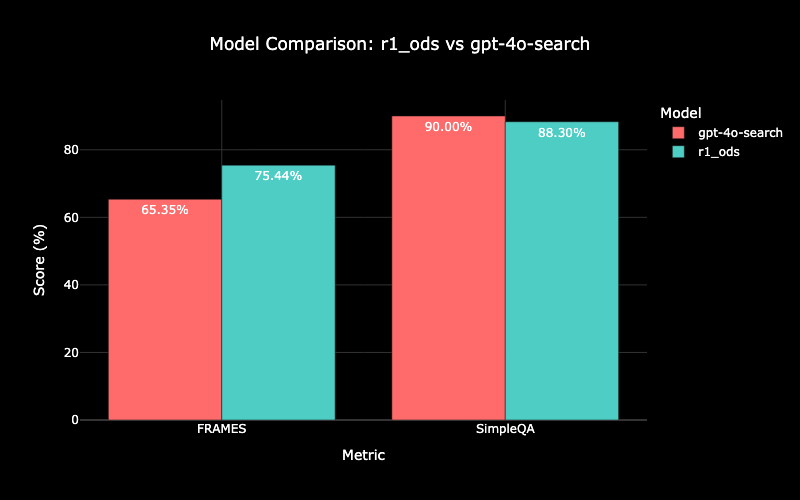

# 🔍OpenDeepSearch: Democratizing Search with Open-source Reasoning Models and Reasoning Agents 🚀

<!-- markdownlint-disable first-line-h1 -->
<!-- markdownlint-disable html -->
<!-- markdownlint-disable no-duplicate-header -->

<div align="center">
    
</div>

<hr>
<div align="center" style="line-height: 1;">
  <a href="https://sentient.xyz/" target="_blank" style="margin: 2px;">
    
  </a>
  <a href="https://github.com/sentient-agi" target="_blank" style="margin: 2px;">
    
  </a>
  <a href="https://huggingface.co/Sentientagi" target="_blank" style="margin: 2px;">
    
  </a>
</div>

<div align="center" style="line-height: 1;">
  <a href="https://discord.gg/sentientfoundation" target="_blank" style="margin: 2px;">
    
  </a>
  <a href="https://x.com/SentientAGI" target="_blank" style="margin: 2px;">
    
  </a>
</div>

<h4 align="center">
        <a href="https://arxiv.org/pdf/2503.20201"> Paper  </a> 
</h4>

## Description 📝

OpenDeepSearch is a lightweight yet powerful search tool designed for seamless integration with AI agents. It enables deep web search and retrieval, optimized for use with Hugging Face's **[SmolAgents](https://github.com/huggingface/smolagents)** ecosystem.

<div align="center">
    
</div>

- **Performance**: ODS performs on par with closed source search alternatives on single-hop queries such as [SimpleQA](https://openai.com/index/introducing-simpleqa/) 🔍.
- **Advanced Capabilities**: ODS performs much better than closed source search alternatives on multi-hop queries such as [FRAMEs bench](https://huggingface.co/datasets/google/frames-benchmark) 🚀.

## Table of Contents 📑

- [🔍OpenDeepSearch: Democratizing Search with Open-source Reasoning Models and Reasoning Agents 🚀](#opendeepsearch-democratizing-search-with-open-source-reasoning-models-and-reasoning-agents-)
  - [Description 📝](#description-)
  - [Table of Contents 📑](#table-of-contents-)
  - [Features ✨](#features-)
  - [Installation 📚](#installation-)
  - [Setup](#setup)
  - [Usage ️](#usage-️)
    - [Using OpenDeepSearch Standalone 🔍](#using-opendeepsearch-standalone-)
    - [Running the Gradio Demo 🖥️](#running-the-gradio-demo-️)
    - [Integrating with SmolAgents \& LiteLLM 🤖⚙️](#integrating-with-smolagents--litellm-️)
  - [Search Modes 🔄](#search-modes-)
    - [Default Mode ⚡](#default-mode-)
    - [Pro Mode 🔍](#pro-mode-)
  - [Acknowledgments 💡](#acknowledgments-)
  - [License 📝](#license-)
  - [Contributing 🤝](#contributing-)
  - [Contact 📩](#contact-)

## Features ✨

- **Semantic Search** 🧠: Leverages **[Crawl4AI](https://github.com/crawl4ai)** and semantic search rerankers (such as [Qwen2-7B-instruct](https://huggingface.co/Alibaba-NLP/gte-Qwen2-7B-instruct/tree/main) and [Jina AI](https://jina.ai/)) to provide in-depth results
- **Two Modes of Operation** ⚡:
  - **Default Mode**: Quick and efficient search with minimal latency.
  - **Pro Mode (Deep Search)**: More in-depth and accurate results at the cost of additional processing time.
- **Optimized for AI Agents** 🤖: Works seamlessly with **SmolAgents** like `CodeAgent`.
- **Fast and Lightweight** ⚡: Designed for speed and efficiency with minimal setup.
- **Extensible** 🔌: Easily configurable to work with different models and APIs.

## Installation 📚

To install OpenDeepSearch, run:

```bash
pip install -e . #you can also use: uv pip install -e .
pip install -r requirements.txt #you can also use: uv pip install -r requirements.txt
```

Note: you must have `torch` installed.
Note: using `uv` instead of regular `pip` makes life much easier!


## Setup

1. **Sign up for Serper.dev**: Get **free 2500 credits** and add your API key.
   - Visit [serper.dev](https://serper.dev) to create an account.
   - Retrieve your API key and store it as an environment variable:
   
   ```bash
   export SERPER_API_KEY='your-api-key-here'
   ```

2. **Choose a Reranking Solution**:
   - **Quick Start with Jina**: Sign up at [Jina AI](https://jina.ai/) to get an API key for immediate use
   - **Self-hosted Option**: Set up [Infinity Embeddings](https://github.com/michaelfeil/infinity) server locally with open source models such as [Qwen2-7B-instruct](https://huggingface.co/Alibaba-NLP/gte-Qwen2-7B-instruct/tree/main)
   - For more details on reranking options, see our [Rerankers Guide](src/opendeepsearch/ranking_models/README.md)

3. **Set up LiteLLM Provider**:
   - Choose a provider from the [supported list](https://docs.litellm.ai/docs/providers/), including:
     - OpenAI
     - Anthropic
     - Google (Gemini)
     - OpenRouter
     - HuggingFace
     - Fireworks
     - And many more!
   - Set your chosen provider's API key as an environment variable:
   ```bash
   export <PROVIDER>_API_KEY='your-api-key-here'  # e.g., OPENAI_API_KEY, ANTHROPIC_API_KEY
   ```
   - When initializing OpenDeepSearch, specify your chosen model using the provider's format:
   ```python
   search_agent = OpenDeepSearchTool(model_name="provider/model-name")  # e.g., "anthropic/claude-3-opus-20240229", 'huggingface/microsoft/codebert-base', 'openrouter/google/gemini-2.0-flash-001'
   ```

## Usage ️

You can use OpenDeepSearch independently or integrate it with **SmolAgents** for enhanced reasoning and code generation capabilities.

### Using OpenDeepSearch Standalone 🔍

```python
from opendeepsearch import OpenDeepSearchTool
import os

# Set environment variables for API keys
os.environ["SERPER_API_KEY"] = "your-serper-api-key-here"
os.environ["OPENROUTER_API_KEY"] = "your-openrouter-api-key-here"
os.environ["JINA_API_KEY"] = "your-jina-api-key-here"

search_agent = OpenDeepSearchTool(model_name="openrouter/google/gemini-2.0-flash-001", reranker="jina")  # Set pro_mode for deep search
# Set reranker to "jina", or "infinity" for self-hosted reranking
query = "Fastest land animal?"
result = search_agent.search(query)
print(result)
```

### Running the Gradio Demo 🖥️

To try out OpenDeepSearch with a user-friendly interface, simply run:

```bash
python gradio_demo.py
```

This will launch a local web interface where you can test different search queries and modes interactively. You can also change the model, reranker, and search mode in `gradio_demo.py`.

### Integrating with SmolAgents & LiteLLM 🤖⚙️

#### 

```python
from opendeepsearch import OpenDeepSearchTool
from smolagents import CodeAgent, LiteLLMModel
import os

# Set environment variables for API keys
os.environ["SERPER_API_KEY"] = "your-serper-api-key-here"
os.environ["OPENROUTER_API_KEY"] = "your-openrouter-api-key-here"
os.environ["JINA_API_KEY"] = "your-jina-api-key-here"

search_agent = OpenDeepSearchTool(model_name="openrouter/google/gemini-2.0-flash-001", reranker="jina") # Set reranker to "jina" or "infinity"
model = LiteLLMModel(
    "openrouter/google/gemini-2.0-flash-001",
    temperature=0.2
)

code_agent = CodeAgent(tools=[search_agent], model=model)
query = "How long would a cheetah at full speed take to run the length of Pont Alexandre III?"
result = code_agent.run(query)

print(result)
```
### ReAct agent with math and search tools 🤖⚙️

#### 
```python
from opendeepsearch import OpenDeepSearchTool 
from opendeepsearch.wolfram_tool import WolframAlphaTool
from opendeepsearch.prompts import REACT_PROMPT
from smolagents import LiteLLMModel, ToolCallingAgent, Tool 
import os

# Set environment variables for API keys
os.environ["SERPER_API_KEY"] = "your-serper-api-key-here"
os.environ["JINA_API_KEY"] = "your-jina-api-key-here"
os.environ["WOLFRAM_ALPHA_APP_ID"] = "your-wolfram-alpha-app-id-here"
os.environ["FIREWORKS_API_KEY"] = "your-fireworks-api-key-here"

model = LiteLLMModel(
    "fireworks_ai/llama-v3p1-70b-instruct",  # Your Fireworks Deepseek model
    temperature=0.7
)
search_agent = OpenDeepSearchTool(model_name="fireworks_ai/llama-v3p1-70b-instruct", reranker="jina") # Set reranker to "jina" or "infinity"

# Initialize the Wolfram Alpha tool
wolfram_tool = WolframAlphaTool(app_id=os.environ["WOLFRAM_ALPHA_APP_ID"])

# Initialize the React Agent with search and wolfram tools 
react_agent = ToolCallingAgent(
    tools=[search_agent, wolfram_tool],
    model=model,
    prompt_templates=REACT_PROMPT # Using REACT_PROMPT as system prompt
)

# Example query for the React Agent
query = "What is the distance, in metres, between the Colosseum in Rome and the Rialto bridge in Venice"
result = react_agent.run(query)

print(result)
```

## Search Modes 🔄

OpenDeepSearch offers two distinct search modes to balance between speed and depth:

### Default Mode ⚡
- Uses SERP-based interaction for quick results
- Minimal processing overhead
- Ideal for single-hop, straightforward queries
- Fast response times
- Perfect for basic information retrieval

### Pro Mode 🔍
- Involves comprehensive web scraping
- Implements semantic reranking of results
- Includes advanced post-processing of data
- Slightly longer processing time
- Excels at:
  - Multi-hop queries
  - Complex search requirements
  - Detailed information gathering
  - Questions requiring cross-reference verification

## Acknowledgments 💡

OpenDeepSearch is built on the shoulders of great open-source projects:

- **[SmolAgents](https://huggingface.co/docs/smolagents/index)** 🤗 – Powers the agent framework and reasoning capabilities.
- **[Crawl4AI](https://github.com/crawl4ai)** 🕷️ – Provides data crawling support.
- **[Infinity Embedding API](https://github.com/michaelfeil/infinity)** 🌍 – Powers semantic search capabilities.
- **[LiteLLM](https://www.litellm.ai/)** 🔥 – Used for efficient AI model integration.
- **Various Open-Source Libraries** 📚 – Enhancing search and retrieval functionalities.

## Citation

If you use `OpenDeepSearch` in your works, please cite it using the following BibTex entry:

```
@article{alzubi2025open,
  title={Open Deep Search: Democratizing Search with Open-source Reasoning Agents},
  author={Salahaddin Alzubi and Creston Brooks and Purva Chiniya and Edoardo Contente and Chiara von Gerlach and Lucas Irwin and Yihan Jiang and Arda Kaz and Windsor Nguyen and Sewoong Oh and Himanshu Tyagi and Pramod Viswanath},
  journal={arXiv preprint arXiv:2503.20201},
  year={2025},
  url={https://arxiv.org/abs/2503.20201}
}
```


## Contact 📩

For questions or collaborations, open an issue or reach out to the maintainers.

