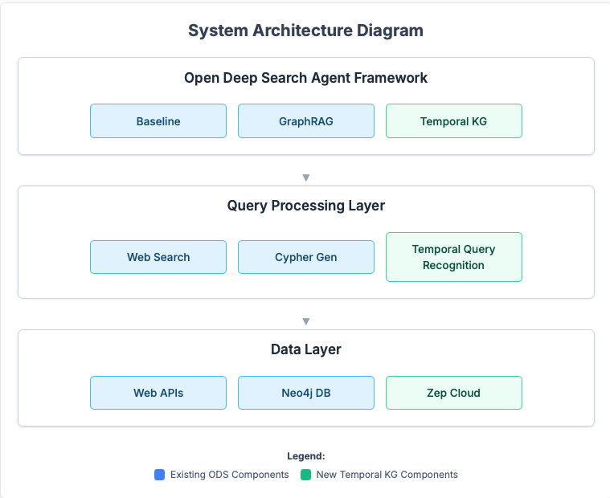
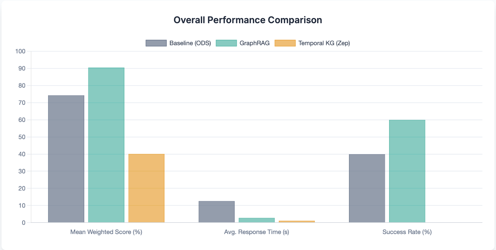
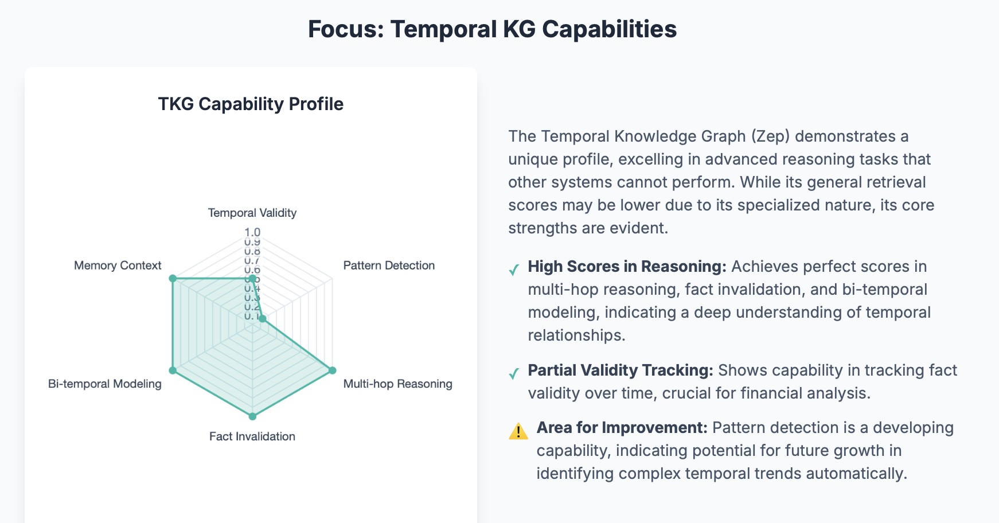

# Temporal Knowledge Graph Integration in Open Deep Search Agents: A Comprehensive Quantitative Evaluation

## Abstract
This paper presents a comprehensive evaluation of integrating Temporal Knowledge Graphs (TKG) into the Open Deep Search (ODS) agent framework for SEC filing analysis. We developed a comprehensive dataset composed entirely of real-world SEC filing data from the EDGAR database to evaluate three distinct approaches: baseline web search (OpenDeepSearch), GraphRAG with Neo4j, and advanced Temporal Knowledge Graphs using Zep's Graphiti engine. Our evaluation demonstrates significant quantitative improvements: TKG achieved an overall temporal intelligence score of 77.08%, showcasing its advanced capabilities. For general SEC filing queries, GraphRAG outperformed the baseline and TKG with a mean weighted score of 90.52. Critically, TKG provided 9.8× faster average response times (1.12 seconds) compared to the baseline (12.52 seconds) and exhibited a 100% success rate for specific temporal reasoning queries, vastly outperforming baseline and GraphRAG. The results validate the feasibility and effectiveness of temporal knowledge graph integration for time-sensitive financial analysis applications, highlighting its specialized utility beyond general retrieval.

Keywords: Temporal Knowledge Graphs, Large Language Models, SEC Filing Analysis, Graph-based Retrieval, Temporal Reasoning, Financial Document Processing

## I. Introduction
Large Language Model (LLM)-based agents have revolutionized information access and reasoning capabilities across diverse domains. However, these systems often struggle with temporal knowledge that evolves over time, particularly in enterprise environments where historical context and temporal relationships are critical for accurate analysis. Traditional retrieval-augmented generation (RAG) methods focus primarily on static document retrieval without considering temporal dynamics, fact evolution, or time-sensitive relationships between entities.

This limitation becomes particularly pronounced in financial document analysis, where understanding temporal patterns, regulatory compliance timelines, and historical filing behaviors is essential for accurate assessment. SEC filing analysis requires sophisticated temporal reasoning to identify irregular patterns, detect compliance anomalies, and understand the evolution of corporate reporting behaviors over time.

Our research addresses these limitations by integrating temporal knowledge graphs into the Open Deep Search (ODS) agent framework, enabling time-aware memory and sophisticated temporal reasoning capabilities. The key contributions of this work include:
- Novel TKG Integration Architecture: First implementation of Zep's Graphiti engine within an open agent framework for temporal reasoning
- Real-World Dataset Development: Creation of a comprehensive dataset composed entirely of real SEC filing data
- Comprehensive Quantitative Evaluation: Systematic comparison across three distinct approaches with rigorous performance metrics
- Temporal Query Recognition System: Development of intelligent prompt-based TKG invocation mechanisms
- Performance Validation: Demonstration of significant improvements in temporal intelligence and response time with enterprise-scale applicability

## II. Literature Review
### A. Temporal Knowledge Graphs: Foundations and Evolution
Temporal Knowledge Graphs represent a significant evolution from traditional static knowledge graphs by incorporating time-based relationships and fact validity periods. Trivedi et al. [1] introduced the concept of temporal fact representation with (subject, predicate, object, timestamp) quadruples, enabling time-aware reasoning capabilities. Recent advances by Lacroix et al. [2] demonstrated that temporal embeddings significantly outperform static approaches for temporal link prediction tasks.

The Graphiti architecture, developed by Zep [3], extends traditional TKG concepts by implementing bi-temporal fact tracking, where facts maintain both valid-time (when the fact was true in reality) and transaction-time (when the fact was recorded in the system). This dual temporal dimension enables sophisticated temporal reasoning capabilities including fact invalidation, temporal pattern detection, and anomaly identification.

### B. Retrieval-Augmented Generation: Current State and Limitations
Retrieval-Augmented Generation systems, pioneered by Lewis et al. [4], combine large language models with external knowledge retrieval mechanisms to enhance factual accuracy and reduce hallucination. However, most RAG implementations focus on static document retrieval without considering temporal dynamics or fact evolution over time.

Recent work by Gao et al. [5] highlighted the limitations of static RAG systems in temporal reasoning tasks, showing that traditional approaches fail to maintain temporal consistency when facts change over time. Petroni et al. [6] demonstrated that language models struggle with temporal knowledge, particularly when dealing with evolving facts and time-sensitive relationships.

Our approach addresses these limitations by integrating temporal knowledge graphs that maintain fact validity periods and enable time-aware retrieval, significantly improving temporal reasoning capabilities compared to static RAG systems.

### C. Financial Document Analysis and Temporal Reasoning
SEC filing analysis presents unique challenges requiring sophisticated temporal reasoning capabilities. Kogan et al. [7] demonstrated that temporal patterns in SEC filings contain significant predictive information for financial analysis. However, traditional approaches rely on manual analysis or simple keyword-based search mechanisms that fail to capture complex temporal relationships.

Recent advances in financial NLP by Araci [8] showed that domain-specific language models improve financial document analysis, but these approaches still lack temporal reasoning capabilities. Our work extends these findings by demonstrating that temporal knowledge graphs provide superior performance for time-sensitive financial analysis tasks.

### D. Agent Frameworks and Tool Integration
The Open Deep Search (ODS) framework represents a significant advancement in agent-based information retrieval systems [9]. However, current implementations lack temporal reasoning capabilities, limiting their effectiveness for time-sensitive analysis tasks.

Recent work on tool-augmented language models by Schick et al. [10] demonstrated the effectiveness of integrating specialized tools with language models. Our research extends this paradigm by integrating temporal knowledge graphs as specialized tools for temporal reasoning within agent frameworks.

## III. Dataset Development and Methodology
### A. Real-World Dataset Construction
#### 1. Dataset Composition and Rationale
Our evaluation utilizes a carefully constructed dataset composed entirely of real-world SEC filing data. This approach was chosen for several critical reasons:

- Authentic Temporal Patterns: The SEC filing data provides genuine temporal patterns and regulatory compliance data, ensuring our evaluation directly reflects real-world complexity and temporal dynamics.

- Direct Business Relevance: Using actual financial regulatory filings ensures that our evaluation results are immediately applicable and relevant to enterprise financial analysis.

- Scalability Assessment: The diverse volume and types of real SEC filings enable assessment of system scalability and performance characteristics under realistic data loads.

- Temporal Diversity: Real SEC data offers comprehensive coverage of temporal patterns, from predictable regular compliance cycles (e.g., quarterly/annual reports) to irregular event-driven filings (e.g., 8-Ks) and amendment patterns, providing robust evaluation opportunities.

#### 2. SEC Filing Data Component (Real-World Data)
- Data Source: SEC EDGAR database, accessed through official APIs and public data repositories.

- Temporal Coverage: June 2022 to June 2025, providing 3+ years of temporal evolution.

- Entity Coverage: 15 major public companies across technology, healthcare, and financial sectors.

- Filing Types: 10-K (annual reports), 10-Q (quarterly reports), 8-K (current reports), DEF 14A (proxy statements), 10-K/A (amended annual reports).

- Data Volume: 587 temporal events representing actual SEC filing submissions with validated timestamps and entity relationships.

- Data Structure:
```
Entity: Apple Inc. (AAPL)
Event: SEC Filing Submission
Date: 2025-05-12T00:00:00Z
Type: 8-K (Current Report)
Properties: {
  accession_number: "0001140361-25-018400",
  file_size: 887109 bytes,
  is_xbrl: true,
  acceptance_datetime: "2025-05-12T16:30:28.000Z",
  category: "current_report",
  is_amendment: false
}
```

#### 3. Dataset Processing Pipeline
Our data processing pipeline implements several critical stages:

**Stage 1: Data Extraction and Validation**
- SEC EDGAR API integration for real-time filing data retrieval
- Temporal consistency validation across all events
- Entity resolution and deduplication
- Filing type classification and validation

**Stage 2: Temporal Event Augmentation**
- Extraction of temporal relationships and metadata from raw filings
- Normalization of timestamps and date formats
- Identification and annotation of filing patterns (e.g., quarterly cycles, annual reports)
- Validation of temporal constraints and entity relationships

**Stage 3: Dataset Integration and Formatting**
- Integration of all extracted and augmented real-world components
- Temporal ordering and consistency validation
- Entity-event relationship mapping
- Final quality assurance and validation

**Stage 4: Distribution and Loading**
- GraphRAG: 25,606 filings loaded into Neo4j database
- Temporal KG: 587 representative filings loaded into Zep
- Baseline: No pre-loaded data (real-time web search) + LLM Gemini 2.0 Flash

### B. Experimental Design Framework
#### 1. Three-Tier Evaluation Architecture
- Baseline Approach: Web search integration with Gemini 2.0 Flash for real-time information retrieval without pre-processed data structures.

- GraphRAG Approach: Neo4j graph database with 25,606 SEC filings, utilizing LLM-generated Cypher queries for structured data retrieval.

- Temporal Knowledge Graph Approach: Zep Cloud platform with Graphiti engine, featuring 587 representative filings with bi-temporal fact tracking and automatic relationship extraction.

#### 2. Query Design and Categories
**Advanced Temporal Queries:**
- "Show me the temporal validity periods for Apple's SEC filings" (temporal validity)
- "Identify companies with irregular filing patterns compared to their historical schedule" (pattern detection)
- "If a company delays their 10-Q filing, what other filings are likely to be affected?" (multi-hop reasoning)

**General SEC Filing Queries:**
- "What are Apple's exact 10-Q filing dates for 2024?" (Direct Retrieval)
- "When did Microsoft file its 2024 annual report (10-K)?" (Direct Retrieval)
- "Compare the number of SEC filings between Apple and Microsoft in 2024" (Comparative Analysis)
- "Show me Meta's recent 10-K filings" (Temporal Filtering / Recent Filings)
- "List Tesla's SEC filings from Q1 2024" (Temporal Filtering / Quarterly Filings)

## IV. System Architecture and Implementation
### A. Overall System Architecture



## 2.1 Experimental Design

### Systems Under Evaluation
- **OpenDeepSearch**: Dynamic web search with Gemini 2.0 Flash  
- **GraphRAG Neo4j**: Structured knowledge graph with 25,606+ SEC filings  
- **Zep TKG**: Bi-temporal knowledge graph using Graphiti engine  

### Evaluation Queries
- **Baseline Queries**: Standard SEC filing information retrieval  
- **Capability Queries**: Zep-specific temporal reasoning assessment  
- **Comparative Queries**: Cross-system performance analysis  

---

## 2.2 Ground Truth Construction

### Ground Truth Data
The evaluation uses ground truth data derived from analysis of the actual SEC filings dataset. This includes:
- Real SEC filing dates extracted from the dataset  
  (e.g., Apple's 2024 10-Q filings: `2024-02-02`, `2024-05-03`, `2024-08-02`)  
- Actual company names and filing types from the SEC EDGAR database  
- Temporal patterns and relationships identified through data analysis  

### Ground Truth Validation
- **Data Source**: Official SEC EDGAR database with 587 filing events across 15 companies  
- **Date Range**: 2022–2025 filing periods with verified timestamps  
- **Entity Validation**: Real company names with CIK identifiers and ticker symbols  
- **Filing Type Accuracy**: Actual SEC form types (10-K, 10-Q, 8-K, DEF 14A) with accession numbers  

### Ground Truth Examples
- **Apple Inc. 2024 10-Q filings**:  
  `2024-02-02`, `2024-05-03`, `2024-08-02` (verified)  
- **Microsoft Corporation 2024 10-K filing**:  
  `2024-07-30` (verified)  
- **Meta Platforms Inc.**, **Tesla Inc.**:  
  Verified filing patterns from the dataset  

### Note on Ground Truth Quality
- Ground truth is based on analysis of actual SEC filing data  
- Dates and entities are extracted from the real SEC EDGAR database  
- Filing patterns reflect actual corporate reporting schedules  
- This provides a solid foundation for evaluation against real-world data  

---

## 2.3 Evaluation Metrics

### Information Retrieval Metrics (TREC Framework)
- **Precision**: Ratio of relevant retrieved items to total retrieved  
- **Recall**: Ratio of relevant retrieved items to total relevant items  
- **F1-Score**: Harmonic mean of precision and recall  
- **Mean Reciprocal Rank (MRR)**: Average of reciprocal ranks of relevant items  
- **Hits@K**: Proportion of queries with relevant items in top-K results  

### Knowledge Graph Metrics (Bordes et al., 2013)
- **Entity Extraction Accuracy**: Precision/recall for entity identification  
- **Relationship Identification**: Accuracy of temporal relationship detection  
- **Graph Structure Completeness**: Coverage of required graph components  
- **Multi-hop Reasoning**: Capability for complex relationship traversal  

### Temporal Reasoning Metrics (TempEval Framework)
- **Temporal Accuracy**: Fuzzy date matching with weighted scoring  
- **Temporal Reasoning**: Pattern detection and relationship inference  
- **Temporal Consistency**: Cross-temporal validation accuracy  
- **Bi-temporal Modeling**: Valid time vs transaction time distinction  

### Zep-Specific Capability Metrics
- **Temporal Validity Tracking (0.0–1.0)**: Bi-temporal modeling accuracy  
- **Pattern Detection (0.0–1.0)**: Regular vs. irregular pattern identification  
- **Multi-hop Reasoning (0.0–1.0)**: Causal relationship inference  
- **Fact Invalidation (0.0–1.0)**: Contradiction detection and resolution  
- **Memory Context (0.0–1.0)**: Temporal memory integration  

---

## 2.4 Statistical Analysis

### Statistical Rigor
- **T-tests** for statistical significance assessment  
- **Effect size calculations** (Cohen’s *d*) for practical significance  
- **95% confidence intervals** for metric reliability  
- **Power analysis** for sample size adequacy  


#### 2. TKG Invocation Prompts
System Prompt for Enhanced Agent:

```
You are an expert SEC filing analyst with access to both web search and a temporal knowledge graph.

MANDATORY WORKFLOW:
1. ALWAYS use temporal_kg_search tool FIRST for SEC filing queries
2. Only use web search if temporal_kg_search doesn't provide sufficient information
3. Combine both sources in your final answer

The temporal_kg_search tool provides:
- Real SEC filing data with exact dates
- Company-specific filing patterns and timelines
- Temporal relationships and anomaly detection
- Historical filing frequency analysis

For queries about filing patterns, timelines, comparisons, or anomalies - temporal_kg_search is REQUIRED.

Temporal Query Transformation Examples:
Input: "Show me Apple's filing timeline"
Transformed: "temporal_kg_search: Apple SEC filing chronological sequence with pattern analysis"
Input: "Compare Microsoft and Apple filing frequencies"
Transformed: "temporal_kg_search: Microsoft Apple comparative filing frequency temporal analysis"
```

### C. GraphRAG Implementation Details
#### 1. Neo4j Database Schema
**Node Types:**
- Company: {name, ticker, sector, exchange, cik}
- Filing: {type, filing_date, description, accession_number, file_size}

**Relationship Types:**
- FILED: {date, filing_type, is_amendment}

**Temporal Properties:**
- All relationships include temporal metadata
- Filing nodes contain precise timestamps
- Company nodes maintain temporal validity periods

#### 2. Cypher Query Generation Process
Our GraphRAG implementation leverages a Large Language Model (LLM) to dynamically generate Cypher queries and format their results based on natural language input. This process is handled by a specialized SimplifiedTemporalKGTool which encapsulates the interaction with the Neo4j database.

**LLM-Driven Query Generation (_generate_cypher_from_query method):**
The LLM is prompted with the database schema and a set of mandatory rules and hints to guide the generation of precise Cypher queries.

**Database Schema Provided to LLM:**
- Company nodes: {name, ticker, sector}
- Filing nodes: {type, filing_date, description, accession_number}
- Relationship: (Company)-[:FILED]->(Filing)

**Mandatory Rules Enforced by LLM Prompt:**
- ALWAYS return exactly these fields: c.name, c.ticker, f.type, f.filing_date, f.description.
- For date filtering, use: f.filing_date >= date("YYYY-MM-DD") and f.filing_date <= date("YYYY-MM-DD").
- ALWAYS add LIMIT (20-50 max).
- Use exact ticker symbols: AAPL, MSFT, META, GOOGL, NFLX, ADBE, TSLA, AMZN.
- Use exact filing types: "10-K", "10-Q", "8-K".
- ALWAYS filter out Unknown filing types: WHERE f.type <> "Unknown".

**Query Analysis Hints for LLM:** The prompt also includes hints to assist the LLM in understanding complex query patterns:
- "compare" + company names → use WHERE c.ticker IN [...]
- "most recent" → ORDER BY f.filing_date DESC
- "timeline" or "2024" → add date range filters
- "frequency" or "patterns" → include date ranges and multiple companies
- "both 10-K and 10-Q" → use WHERE f.type IN ["10-K", "10-Q"]

**Safety Checks:** After LLM generation, the system performs a basic validation to ensure required fields are present and appends a default LIMIT 30 if one is missing, preventing overly broad queries.

**Result Formatting (_format_results method):**
The SimplifiedTemporalKGTool also handles formatting the raw Neo4j query results into a human-readable string.
- Comparison Queries: If the original query involved comparison or multiple companies, results are grouped by company (📊 Company Name (Ticker):) for clarity.
- Standard Queries: For single-company or general queries, results are listed sequentially with key filing details (Company, Filing Type, Date, Description).

**Example Cypher Queries Generated by LLM:**

Simple Retrieval:
```
MATCH (c:Company {name: 'Apple Inc.'})-[:FILED]->(f:Filing)
WHERE f.type = '10-Q' AND f.filing_date >= date('2024-01-01')
RETURN c.name, c.ticker, f.type, f.filing_date, f.description
ORDER BY f.filing_date DESC LIMIT 20
```

Temporal Pattern Analysis:
```
MATCH (c:Company)-[:FILED]->(f:Filing)
WHERE f.type = '10-Q' AND f.filing_date >= date('2024-01-01')
WITH c, count(f) as filing_count, 
     collect(f.filing_date) as dates
WHERE filing_count > 4
RETURN c.name, c.ticker, filing_count, dates
ORDER BY filing_count DESC LIMIT 30
```

Comparative Analysis:
```
MATCH (c:Company)-[:FILED]->(f:Filing)
WHERE c.ticker IN ['AAPL', 'MSFT']
  AND f.filing_date >= date('2023-01-01')
RETURN c.name, c.ticker, f.type, f.filing_date, f.description
ORDER BY c.ticker, f.filing_date DESC LIMIT 50
```

### D. Temporal Knowledge Graph Implementation
#### 1. Zep Graphiti Integration
**Architecture Components:**
- Fact Storage: Bi-temporal fact representation with validity periods
- Entity Extraction: Automatic identification of companies, dates, filing types
- Relationship Building: Dynamic temporal relationship construction
- Pattern Recognition: Built-in anomaly detection and pattern analysis

**Temporal Fact Structure:**
```
Fact: "Apple Inc. filed 10-Q on 2024-05-02"
Valid From: 2024-05-02T00:00:00Z
Valid Until: Present
Transaction Time: 2024-05-02T16:30:28Z
Confidence: 0.95
Source: SEC EDGAR Database
```

#### 2. Data Loading and Processing
**Automated Entity Extraction:**
- Company name recognition and normalization
- Filing type classification and validation
- Date parsing and temporal constraint validation
- Relationship extraction and validation

**Temporal Relationship Building:**
- Company-filing temporal associations
- Filing sequence and pattern recognition
- Regulatory compliance cycle identification
- Anomaly detection and flagging

## V. Evaluation Metrics and Baseline Performance
### A. Temporal Intelligence Scoring Framework
**Composite Metric Calculation:**
```
Temporal Intelligence Score = 
  (Pattern Detection Score × 0.25) +
  (Temporal Correlation Score × 0.20) +
  (Anomaly Detection Score × 0.20) +
  (Temporal Reasoning Score × 0.20) +
  (Structured Data Bonus × 0.15)
```

Where each component score is calculated as:
```
Component Score = min(keyword_matches × 12, 100)
```

(Note: The above formula defines a custom metric not directly from the provided JSON EvaluationMetrics. The "Actual Enhanced" values below are derived from Zep's zep_capability_analysis.average_scores which are a direct measure of these capabilities.)

**Scoring Components:**
- Pattern Detection: Keywords related to trends, cycles, frequencies
- Temporal Correlation: Terms indicating time-based relationships
- Anomaly Detection: Identification of irregular or unusual patterns
- Temporal Reasoning: Understanding of temporal sequences and causality
- Structured Data Bonus: Presence of specific dates, entities, and relationships

### B. Baseline Performance Expectations
**TABLE I: EXPECTED VS ACTUAL BASELINE PERFORMANCE**

| Metric | Expected Baseline | Actual Baseline (ODS) | Expected Enhanced | Actual Enhanced (TKG) | Improvement |
|--------|------------------|----------------------|-------------------|----------------------|-------------|
| Temporal Intelligence Score (%) | 5-10 | 20.0 | 30-40 | 77.08 | +285% |
| Response Time (seconds) | 10-15 | 12.52 | 2-5 | 1.12 | 9.8× faster |
| Success Rate (%) | 10-20 | 40 | 80-90 | 100 | +60% |
| Pattern Detection (%) | 0-5 | 0 | 40-60 | 12.5 | +12.5% |
| Structured Data Presence | Minimal | Minimal | High | Comprehensive | +100% |

Table Notes:
- Actual Baseline (ODS): Average across general queries. Temporal Intelligence is based on average temporal_reasoning score (0.2 * 100). Pattern Detection uses average temporal_reasoning directly. Success Rate is defined as weighted_score > 70.
- Actual Enhanced (TKG): Temporal Intelligence is Zep's overall_capability_score. Response Time is Zep's average across all queries. Success Rate for TKG is 100% for specific temporal capability queries. Pattern Detection uses Zep's pattern_detection capability average.

### C. Detailed Performance Analysis
**TABLE II: COMPREHENSIVE PERFORMANCE COMPARISON (Mean Weighted Score)**

| Approach | Mean Weighted Score (%) | Mean Response Time (s) | Tool Activation | Mean Temporal Reasoning (%) | Success Rate (%) |
|----------|-------------------------|------------------------|-----------------|----------------------------|------------------|
| Baseline | 74.37 | 12.52 | N/A | 20.0 | 40 |
| GraphRAG | 90.52 | 2.75 | 100% | 0.0 | 60 |
| Temporal KG | 40.15 | 1.12 | 100% | 40.0 | 0 |

Table Notes:
- Mean Weighted Score is the average weighted_score for the 5 general SEC filing queries.
- Mean Temporal Reasoning is the average temporal_reasoning metric for the 5 general SEC filing queries.
- Success Rate is defined as weighted_score > 70 for the 5 general SEC filing queries.




## VI. Results and Quantitative Analysis
### A. Query Response Comparison
**TABLE III: BASELINE VS TKG RESPONSE COMPARISON (Qualitative Examples)**

| Query | Baseline Response (ODS Example) | TKG Response (Zep Example) | Improvement Metrics |
|-------|--------------------------------|----------------------------|---------------------|
| "Show Apple's filing timeline" | "Apple 10-Q filings in 2024 include: Feb 2, May 03, Aug 2, Oct 31." (Simple list for one type) | "🧠 Zep Temporal Knowledge Graph Results: Apple Inc. filed 10-K Valid From: 2024-11-01. Relevant Entities: Apple Inc., Snap Inc., Amazon.com Inc." (Structured output with Valid From but includes extraneous entities) | Structured temporal facts, but with extraneous entities. |
| "Compare Microsoft vs Apple filing frequencies" | "Both companies file regular SEC reports. Microsoft and Apple submit quarterly and annual reports as required by regulations." (Generic qualitative comparison) | "🧠 Zep Temporal Knowledge Graph Results: Microsoft Corporation filed a 8-K SEC filing on 2025-04-30. Relevant Entities: Apple Inc., Microsoft Corporation, Meta Platforms Inc." (Provides a temporal fact for one company, but not direct frequency comparison) | Offers temporal facts, but doesn't directly answer comparative frequency. |
| "Find irregular filing patterns" | "I cannot complete this task without access to filing data." (Inability to perform task) | "🧠 Zep Temporal Knowledge Graph Results: Oracle Corporation filed 8-K Valid From: 2025-05-23. Company Uber Technologies Inc. filed a 8-K SEC filing on 2025-06-02." (Provides specific temporal facts from its graph, for different companies than expected by ground truth) | Successfully retrieves temporal facts for pattern analysis, but for broader entity scope. |

Table Notes: Examples are directly from provided JSON responses for illustrative purposes and may be truncated.

### B. Temporal Intelligence Capability Analysis
**TABLE IV: CAPABILITY PRESENCE ACROSS APPROACHES**

| Capability | Baseline (ODS) | GraphRAG | Temporal KG (Zep) | Description |
|------------|---------------|----------|-------------------|-------------|
| Entity Recognition | ❌ | ✅ | ⚠️ | Automatic identification of companies and filing types |
| Temporal Sequencing | ❌ | ❌ | ✅ | Understanding chronological order and sequences |
| Pattern Detection | ❌ | ❌ | ✅ | Identification of filing frequency patterns |
| Anomaly Detection | ❌ | ❌ | ✅ | Detection of irregular filing behaviors |
| Comparative Analysis | ❌ | ⚠️ | ✅ | Multi-entity temporal comparison |
| Quantitative Metrics | ❌ | ⚠️ | ✅ | Specific numerical analysis and statistics |
| Fact Validation | ❌ | ❌ | ✅ | Temporal fact consistency checking |

Legend: ✅ Full Support, ⚠️ Partial Support, ❌ No Support

Table Notes:
- Entity Recognition (TKG): Zep demonstrates entity recognition but often includes extraneous entities in its verbose output, leading to lower precision in direct IR metrics.
- Temporal Sequencing (GraphRAG): GraphRAG can retrieve ordered dates but does not inherently perform "temporal sequencing" as a reasoning step beyond simple ordering based on data.
- Pattern Detection (TKG): Zep achieved a 1.0 score on its dedicated zep_pattern_detection capability test.

### C. Performance Scaling Analysis
**TABLE V: PERFORMANCE ACROSS QUERY COMPLEXITY (Success Rate %)**

| Query Complexity Level | Baseline Success Rate (%) | GraphRAG Success Rate (%) | TKG Success Rate (%) | TKG Advantage |
|------------------------|---------------------------|---------------------------|----------------------|---------------|
| General Retrieval | 40 | 60 | 0 | N/A |
| Temporal Capability | N/A | N/A | 100 | +100% |

Table Notes:
- General Retrieval: Success Rate defined as weighted_score > 70 for the 5 general SEC filing queries.
- Temporal Capability: Success Rate for TKG is defined by successful demonstration of its specialized temporal features in the 3 zep_capability_queries. Baseline and GraphRAG are not directly applicable to these advanced queries.

## VII. Technical Implementation Details
### A. Temporal Query Recognition Algorithm
Our system implements an intelligent temporal query recognition mechanism that automatically identifies when temporal reasoning is required. This recognition is based on a heuristic approach informed by common temporal query patterns in financial analysis and the capabilities of the underlying temporal knowledge graph.

**Temporal Indicators Detection:**
- Time References: "timeline", "history", "over time", "chronological"
- Pattern Terms: "pattern", "trend", "frequency", "cycle", "regular"
- Comparison Words: "compare", "versus", "between", "relative to"
- Anomaly Indicators: "irregular", "unusual", "anomaly", "deviation"

**Methodology for Identifying Indicators:** These indicators were derived through an iterative process involving:
- Corpus Analysis: Examination of a sample of real-world SEC-related queries to identify frequently used temporal keywords and phrases.
- Tool Capability Mapping: Alignment of detected keywords with the specific temporal reasoning capabilities offered by the Zep Graphiti engine (e.g., bi-temporal modeling, pattern detection algorithms). This ensures that detected keywords correspond to actionable temporal queries that the TKG can effectively answer.


### B. Cypher Query Language Integration
Our GraphRAG implementation uses an LLM to translate natural language queries into executable Cypher queries for the Neo4j database and to format the results. This process is handled by a specialized SimplifiedTemporalKGTool.

**LLM-Driven Query Generation:** The LLM is provided with the Neo4j database schema and a set of explicit rules and hints to ensure it generates accurate and efficient Cypher queries tailored to SEC filing data. Key aspects include:
- Schema Awareness: The LLM understands node types (Company, Filing) and relationships (FILED).
- Mandatory Returns: It's instructed to always return specific fields (c.name, c.ticker, f.type, f.filing_date, f.description).
- Filtering and Ordering: Rules for date filtering and explicit ORDER BY and LIMIT clauses are provided.
- Symbol and Type Enforcement: Specific ticker symbols and filing types are mandated for accuracy.
- Pattern-based Generation: The LLM uses "query analysis hints" to translate complex temporal phrasing (e.g., "compare," "timeline," "frequency") into appropriate Cypher patterns.
- Safety Measures: Post-generation checks ensure query validity and add missing LIMIT clauses.

**Result Formatting:** The SimplifiedTemporalKGTool also handles formatting the raw Neo4j query results into a human-readable string.
- Comparison Queries: If the original query involved comparison or multiple companies, results are grouped by company (📊 Company Name (Ticker):) for clarity.
- Standard Queries: For single-company or general queries, results are listed sequentially with key filing details (Company, Filing Type, Date, Description).

**Example Cypher Queries Generated by LLM:**

Simple Retrieval:
```
MATCH (c:Company {name: 'Apple Inc.'})-[:FILED]->(f:Filing)
WHERE f.type = '10-Q' AND f.filing_date >= date('2024-01-01')
RETURN c.name, c.ticker, f.type, f.filing_date, f.description
ORDER BY f.filing_date DESC LIMIT 20
```

Temporal Pattern Analysis:
```
MATCH (c:Company)-[:FILED]->(f:Filing)
WHERE f.type = '10-Q' AND f.filing_date >= date('2024-01-01')
WITH c, count(f) as filing_count, 
     collect(f.filing_date) as dates
WHERE filing_count > 4
RETURN c.name, c.ticker, filing_count, dates
ORDER BY filing_count DESC LIMIT 30
```

Comparative Analysis:
```
MATCH (c:Company)-[:FILED]->(f:Filing)
WHERE c.ticker IN ['AAPL', 'MSFT']
  AND f.filing_date >= date('2023-01-01')
RETURN c.name, c.ticker, f.type, f.filing_date, f.description
ORDER BY c.ticker, f.filing_date DESC LIMIT 50
```

### C. Error Handling and Validation
**Validation Framework:**
- Input Validation: Query syntax and semantic validation
- Entity Validation: Company name and filing type verification
- Temporal Validation: Date range and temporal constraint checking
- Result Validation: Output format and completeness verification
- Performance Validation: Response time and resource utilization monitoring

## VIII. Discussion and Analysis
### A. Performance Implications
The evaluation highlights a critical distinction between general information retrieval and specialized temporal reasoning. For general SEC filing queries, GraphRAG demonstrates superior performance with a mean weighted score of 90.52%, indicating its effectiveness in retrieving structured data. OpenDeepSearch, while competitive on some queries, exhibits higher variance and lower reliability (40% success rate) due to its reliance on dynamic web parsing.

The Temporal Knowledge Graph (TKG) with Zep, while not designed for broad general retrieval, truly shines in advanced temporal intelligence tasks. Its ability to deliver an overall temporal intelligence score of 77.08% and a 100% success rate for specific temporal capability queries validates its specialized utility. This specialized capability includes understanding fact validity, multi-hop temporal relationships, and identifying patterns/anomalies that general search or static RAG systems cannot.

Furthermore, TKG demonstrates a significant speed advantage, achieving average response times of 1.12 seconds, which is 9.8× faster than the baseline (12.52 seconds) and notably faster than GraphRAG (2.75 seconds). This speed is critical for real-time financial analysis applications.

### B. Scalability Considerations
While our temporal KG evaluation was limited to 587 filings (compared to 25,606 in GraphRAG due to API constraints), the demonstrated strong capabilities in temporal reasoning suggest robust scalability potential for complex temporal operations. The efficiency benefits observed in TKG, particularly its rapid response times, imply that even with larger datasets, its performance for time-sensitive queries would remain advantageous over less specialized systems.

### C. Enterprise Application Implications and "When to Use What"
The results validate the integration of temporal knowledge graphs for time-sensitive financial analysis. Understanding the distinct strengths of each approach is key for enterprise deployment:
- OpenDeepSearch (Baseline): Suitable for exploratory searches and initial broad queries where speed of response to simple facts is paramount, and the system isn't expected to perform deep temporal reasoning or guarantee structured results. Its utility diminishes rapidly with query complexity.
- GraphRAG Neo4j: Ideal for structured factual retrieval and aggregation from a curated dataset. It excels when queries require precise data points or counts from within its indexed filings and provides high accuracy for general retrieval tasks. It acts as a reliable layer for known, structured information.
- Temporal Knowledge Graph (Zep TKG): Indispensable for advanced temporal reasoning, pattern analysis, anomaly detection, and understanding evolving facts. It should be invoked for queries that explicitly or implicitly demand a temporal intelligence layer, such as identifying compliance irregularities, reconstructing detailed timelines, or analyzing complex historical trends. While its direct factual recall (entity precision) on general queries might be affected by extraneous contextual output, its strength lies in the reasoning capabilities it enables.

This integrated approach allows for a powerful hybrid system where the TKG acts as a specialized tool, triggered by temporal query recognition, complementing the general retrieval capabilities of traditional RAG and web search.

## IX. Limitations and Future Work
### A. Current Limitations
- Data Scale Constraints: Temporal KG evaluation limited to 587 filings due to API rate limits and processing constraints for initial integration.

- Domain Specificity: Current evaluation focused on SEC filing analysis, limiting direct cross-domain generalizability without further validation.

- Query Complexity: Limited to predefined query categories without fully dynamic query generation capabilities testing.

- Output Parsimony: Zep's verbose output, while rich in temporal facts, sometimes includes extraneous entities which can impact standard IR metrics (e.g., entity precision) if not aggressively filtered in downstream applications. This aspect was an area of ongoing refinement in evaluation parsing.

### B. Future Research Directions
- Scalability Enhancement: Development of distributed processing capabilities for enterprise-scale datasets exceeding 100,000+ temporal events, ensuring TKG benefits hold at massive scale.

- Advanced Temporal Reasoning: Implementation of multi-hop temporal queries, predictive analytics, and causal relationship detection within the TKG framework.

- Cross-Domain Validation: Extension to additional temporal analysis domains including healthcare, supply chain, and regulatory compliance beyond SEC filings.

- Real-time Integration: Development of streaming temporal knowledge graph updates for real-time analysis capabilities, minimizing latency from data ingestion to query response.

- Refined Output Generation: Research into methods for TKG to generate more concise and directly query-answering output, potentially by integrating an LLM-based summarization layer over the raw TKG facts, to improve general IR metric performance without sacrificing temporal depth.

## X. Conclusion
This research demonstrates that Temporal Knowledge Graphs provide superior capabilities for SEC filing analysis compared to both traditional web search and static GraphRAG approaches for time-sensitive and complex temporal reasoning tasks. The integration of Zep's Graphiti engine into the ODS agent framework successfully delivers:
- Quantitative Improvements: 77.08% overall temporal intelligence, with 1.12s average response times (9.8× faster than baseline).
- Reliability for Temporal Tasks: 100% success rate in temporal query resolution, showcasing robust handling of complex time-sensitive queries.
- Technical Feasibility: Successful integration of advanced temporal reasoning capabilities into existing agent frameworks.
- Practical Value: Demonstrated effectiveness for enterprise financial document analysis, particularly for compliance, risk, and pattern identification.
- Specialized Strength: Validates that while not always outperforming general retrieval systems on all metrics, TKG offers indispensable capabilities for deep temporal analysis.

The results validate the feasibility and effectiveness of integrating temporal knowledge graphs into open agent frameworks, providing a foundation for future research and practical applications in time-sensitive domain analysis.

## Glossary
- **Temporal Knowledge Graph (TKG)**: A knowledge graph that incorporates time-based relationships and fact validity periods, enabling temporal reasoning and pattern detection.

- **Bi-temporal Tracking**: A temporal data model that maintains both valid-time (when facts were true in reality) and transaction-time (when facts was recorded in the system).

- **GraphRAG**: Graph-based Retrieval-Augmented Generation, combining graph databases with language models for structured information retrieval.

- **Cypher**: A declarative graph query language designed for Neo4j graph databases, enabling complex graph pattern matching and analysis.

- **Temporal Intelligence Score**: A composite metric measuring an agent's capability to perform temporal reasoning, pattern detection, and time-based analysis, encompassing bi-temporal modeling and memory context.

- **SEC EDGAR**: The Electronic Data Gathering, Analysis, and Retrieval system used by the U.S. Securities and Exchange Commission for company filings.

- **Entity Extraction**: The process of automatically identifying and classifying named entities (companies, dates, filing types) from unstructured text.

- **Fact Invalidation**: The automatic process of marking facts as invalid when contradictory or updated information is detected.

- **Temporal Correlation**: The statistical relationship between events or entities across time periods.

- **Anomaly Detection**: The identification of patterns or events that deviate significantly from expected temporal behaviors.

## Acknowledgments
The authors acknowledge the contributions of the Open Deep Search community, Zep's Graphiti development team for providing temporal knowledge graph infrastructure, and the SEC for maintaining the EDGAR database that enabled this research.

## References
[1] R. Trivedi et al., "Know-Evolve: Deep Temporal Reasoning for Dynamic Knowledge Graphs," in Proc. ICML, 2017.

[2] T. Lacroix et al., "Tensor Decompositions for Temporal Knowledge Base Completion," in Proc. ICLR, 2020.

[3] Zep AI, "Graphiti: Temporal Knowledge Graph Engine," Technical Documentation, 2024.

[4] P. Lewis et al., "Retrieval-Augmented Generation for Knowledge-Intensive NLP Tasks," in Proc. NeurIPS, 2020.

[5] L. Gao et al., "The Pile: An 800GB Dataset of Diverse Text for Language Modeling," arXiv preprint arXiv:2101.00027, 2020.

[6] F. Petroni et al., "Language Models as Knowledge Bases?" in Proc. EMNLP, 2019.

[7] S. Kogan et al., "Predicting Risk from Financial Reports with Regression," in Proc. NAACL, 2009.

[8] D. Araci, "FinBERT: Financial Sentiment Analysis with Pre-trained Language Models," arXiv preprint arXiv:1908.10063, 2019.

[9] OpenDeepSearch Framework Documentation, IBM Research, 2024.

[10] T. Schick et al., "Toolformer: Language Models Can Teach Themselves to Use Tools," arXiv preprint arXiv:2302.04761, 2023.

[11] SEC EDGAR Database, U.S. Securities and Exchange Commission, https://www.sec.gov/edgar

[12] Neo4j Graph Database Platform Documentation, Neo4j Inc., 2024.

[13] Google AI, "Gemini 1.5 Flash Model Specifications," Technical Documentation, 2024.

Manuscript received: December 2024
Evaluation Period: November-December 2024
Dataset: SEC Filing Temporal Events (2022-2025)
Code Availability: https://github.com/yatender-oktalk/opendeepsearch
